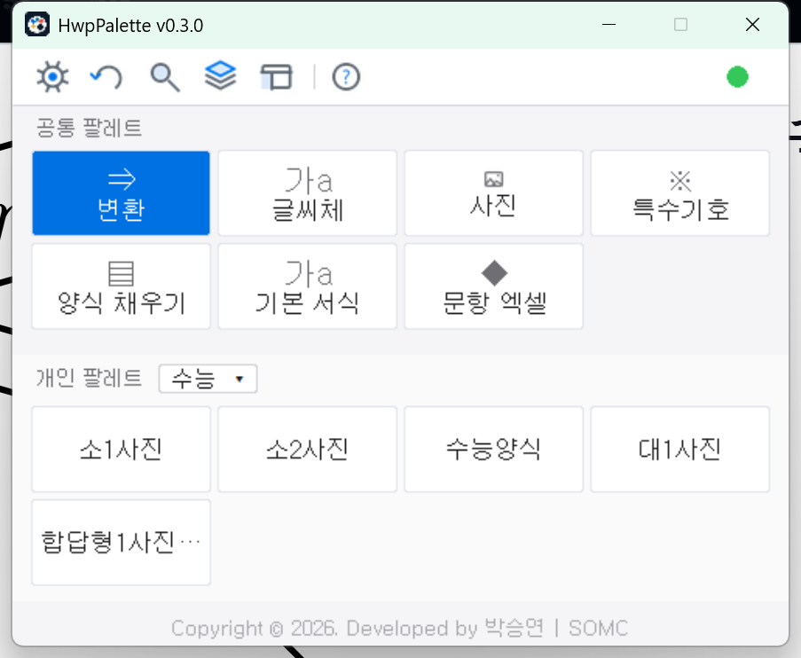
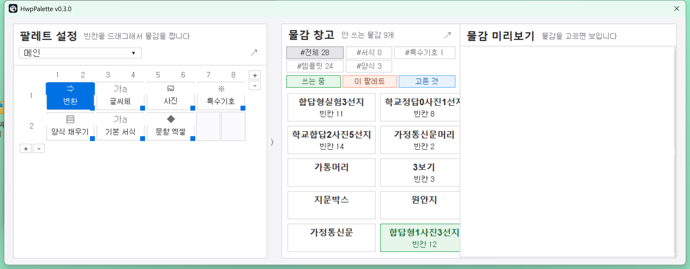
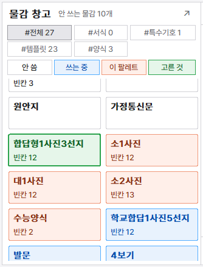

# HwpPalette

**나만의 물감, 나만의 팔레트** — 한글(HWP) 문서 작업을 빠르게 하는 Windows 데스크톱 팔레트.

시험지·가정통신문을 만들 때마다 되풀이하는 일이 있다. 특수기호를 메뉴에서 뒤지고,
지난 시험지에서 표를 복사해 오고, 발문 서식을 매번 손으로 맞춘다. HwpPalette 는
그런 반복을 화면의 **블럭(물감) 클릭 한 번**으로 줄인다.

Python + Tkinter 로 만들었고, pyhwpx(COM 자동화)로 **실제 한글 프로그램을 원격
조종**한다. 흉내 내서 그리는 게 아니라 한글이 직접 만들기 때문에, 결과물은
한글에서 손으로 만든 것과 똑같다.

무엇을 등록할지, 어떤 이름으로 부를지, 어디에 배치할지는 전부 쓰는 사람이 정한다.
프로그램은 그 등록물을 실행해 줄 뿐이다.



*메인 창 — 위는 공통 팔레트(항상 보이는 도구, 아이콘+이름 카드), 아래는 개인 팔레트(문서 종류별로 드롭다운으로 갈아끼우는 글자 카드).*

---

## 이런 일을 합니다

- **블럭 클릭 한 번으로 실행** — 자주 쓰는 문자·문구 삽입, 결재란·보기박스 같은
  문서 조각 삽입, 굵게+글꼴+자간 같은 서식 여러 개 한꺼번에 적용, hwp 양식
  파일을 새 문서로 열기.
- **마크다운 변환** — 한글에서 텍스트를 선택하고 Ctrl+Alt+T. 시험문제 전용
  문법(`발문:` `질문:` `보기:` `선지:`), LaTeX풍 서식 명령(`\굵게{ }`), 빈칸
  채우기, 내장 기호 470여 개, 사진 삽입까지 한 번에 조판된다.
- **문항 엑셀** — 마크다운을 몰라도 된다. 엑셀 표에 문항을 채우면 시험지
  마크다운이 만들어진다(합답형·정답형·서술형, 정답표 포함).
- **물감 창고** — 등록한 서식·문자·템플릿·양식을 한 곳에서 관리하고, 팔레트
  설정 창에서 드래그로 격자에 배치한다.
- **주고받기** — 팔레트를 파일 하나로 내보내 동료와 공유한다. 그 팔레트가 쓰는
  물감과 조각 파일이 자동으로 함께 담기고, 받는 쪽 데이터를 덮어쓰지 않는다.
- **한글과 도킹** — 우리 창이 한글 창을 감싸 항상 옆에 붙는 모드.
- 그 밖에 되돌리기(↺), 통합 찾기(Ctrl+K), 밝게/어둡게 테마(재시작할 때 적용),
  화면 크기 2단(작게/크게), 처음 쓰는 사람을 위한 튜토리얼.

---

## 설치와 실행

필요한 것은 셋이다.

1. **Windows**
2. **한컴오피스 한글** — 이 프로그램은 한글을 조종하는 도구이지, 한글을 대신하지 않는다
3. **Python 3.10 이상** — [python.org](https://www.python.org/downloads/) 에서 설치

받아서 실행:

```bash
git clone https://github.com/seungyeon980808-pixel/HwpPalette.git
cd HwpPalette
run.bat
```

`run.bat` 은 pyhwpx 가 없으면 자동으로 설치한 뒤 프로그램을 켠다. 직접 하려면:

```bash
pip install -r requirements.txt
python main.py
```

- Git 이 없으면 GitHub 에서 **Code → Download ZIP** 으로 받아 풀어도 된다.
- 한글을 미리 켜둘 필요는 없다 — 블럭을 누르면 자동으로 연결된다.
- 처음 켜면 쓰는 법을 안내하는 튜토리얼이 뜬다.
- 파이썬이 없는 PC(동료 컴퓨터 등)에 건네려면 `build_exe.py` 로 exe 하나로
  묶을 수 있다. 그래도 한글은 필요하다.

---

## 5분 빠른 시작

핵심 흐름은 하나다: **한글에서 쓰고 → 선택하고 → Ctrl+Alt+T.**

1. 프로그램을 켜고, 한글에서 새 문서를 연다.
2. 아래 내용을 한글에 그대로 친다.

```
번호: 1
발문: 다음은 빛의 굴절에 대한 설명이다.
자료: 빛은 한 매질에서 다른 매질로 들어갈 때 경계면에서 꺾인다.
질문: 이에 대한 설명으로 옳은 것은?
선지:
매질이 바뀌면 빛의 속력이 변한다
굴절각은 항상 입사각보다 크다
진공에서는 빛이 진행하지 못한다
굴절은 소리에서는 일어나지 않는다
빛의 진동수는 매질에 따라 변한다
```

3. 방금 친 부분을 드래그로 선택하고 **Ctrl+Alt+T** 를 누른다.
4. 선택한 글이 평가원 양식(문항 번호, 자료 상자, ①~⑤ 선지 표)으로 조판된다.

서식과 기호도 같은 흐름이다. 문장 중간에 `\굵게{옳지 않은}` 이나 `\원1\` 을
써 두고 변환하면, 그 부분만 굵어지고 그 자리에 ① 이 들어간다.

결과가 마음에 안 들면 팔레트의 **↺ 되돌리기**를 누른다 — 이 프로그램이
마지막으로 한 일을 통째로 되돌린다. 한글의 Ctrl+Z 를 몇 번 눌러야 하는지
세지 않아도 된다.

---

## 마크다운 문법 요약

문법에 쓰는 기호는 역슬래시 `\` 와 중괄호 `{ }` 두 가지뿐이다.
`\라벨\` 은 등록해 둔 것을 *꺼내 넣기*, `\명령{내용}` 은 그 부분에 *서식 입히기*다.

| 하고 싶은 것 | 이렇게 쓴다 | 예 |
| --- | --- | --- |
| 시험문제 조판 | `번호:` `발문:` `자료:` `질문:` `보기:` `선지:` | 위 빠른 시작 참고 |
| 등록·내장한 것 꺼내 넣기 | `\라벨\` | `\원1\` → ①, `\결재란\` |
| 글자에 서식 입히기 | `\명령{내용}` | `\굵게{옳지 않은}` |
| 서식 여러 개 겹치기 | `\명령,명령{내용}` | `\굵게,색빨강{경고}` |
| 크기·자간·색·글꼴 | `\크기15{ }` `\자간-5{ }` `\색빨강{ }` `\글꼴나눔고딕{ }` | `\색#0969da{파랑 글씨}` |
| 등록해 둔 서식 부르기 | `\서식라벨{내용}` | `\내강조{핵심}` |
| 템플릿 꺼내 빈칸 채우기 | `\템플릿라벨\` 단독 줄 + 아랫줄들 | 아랫줄이 빈칸을 위에서부터 채운다 |
| 빈칸 하나 건너뛰기 | 그 줄에 `-` 하나만 | 그 칸은 비워진다 |
| 한 칸에 여러 줄 넣기 | `{` 로 열고 `}` 로 닫기 | `{(가) 첫 줄` 부터 `(나) 끝 줄}` 까지 한 칸 |
| 표 만들기 | `\표3*3\` 단독 줄 + 행 줄들 | `1&2&3` — `&` 가 칸 구분 |
| 빈칸 표시 (양식·템플릿 만들 때) | `\` (이름 없음), `\학년\` (이름 있음) | 채우기 표에 '학년'으로 나온다 |
| 사진 넣기 | `\파일이름\` | 연결한 사진 폴더의 그림이 그 자리에 |
| 내장 기호 | `\원1\` `\로마3\` `\홑낫표\` | ① Ⅲ 「」 — 470여 개 |
| 글자 그대로 쓰기 | `\\` `\}` `&&` | 역슬래시·중괄호·`&` 를 글자로 |

전체 규칙과 예시는 [docs/문법.md](docs/문법.md) 에 있다. 그 문서의 근거는
코드다 — 문서와 동작이 다르면 코드가 맞다.

---

## 블럭과 팔레트 개념

메인 창은 두 단이다.

- **공통 팔레트 (위)** — 어떤 문서를 만들든 늘 쓰는 도구. 아이콘+이름 카드로 항상 보인다.
- **개인 팔레트 (아래)** — 문서 종류별 블럭 모음. '시험지', '가정통신문'처럼
  팔레트를 여러 개 만들어 두고 드롭다운으로 갈아끼운다.

블럭은 클릭하면 실행되는 최소 단위이고 네 종류다.

| 블럭 | 하는 일 | 예 |
| --- | --- | --- |
| **문자** | 커서 자리에 문자·문구 삽입 | `√` `℃` `㉠`, 상용 인사말 |
| **템플릿** | 문서 조각을 통째로 커서 자리에 삽입 | 결재란, 보기박스 |
| **서식 조합** | 선택 영역에 서식 여러 개를 한 번에 적용 | 굵게+글꼴+자간+크기 |
| **양식** | hwp 파일 전체를 새 문서로 열기 | 가정통신문, 계획서 표지 |

> **템플릿과 양식의 차이** — 템플릿은 *쓰던 문서에 꽂는 것*이라 용지·여백이
> 안 따라온다. 양식은 *그 양식으로 새로 시작하는 것*이라 용지·여백·머리말까지
> 그대로 열린다.

여기에 **도구 블럭**이 더 있다. 앱 자체 기능도 블럭 한 종류로 만들어 같은
규칙에 태웠다 — 마크다운 변환 · 자간 맞춤 · 사진 · 특수기호 · 양식 채우기 ·
문항 엑셀 · 라이브러리 · 통합 찾기. 다른 블럭처럼 옮기고 지울 수 있다.
(마크다운 변환은 이 프로그램의 본체라서, 마지막 하나만은 지워지지 않는다.)

블럭 배치는 팔레트 설정(⚙)에서 한다. 격자에 드래그로 놓고, 빈칸을 끌어
원하는 크기로 만든다.



*팔레트 설정 창 — 격자에 드래그로 배치하고, 물감 창고에서 골라 넣고, 미리보기로 바로 확인한다.*

등록한 물감(서식·문자·템플릿·양식)은 **물감 창고**에 모인다. 한글에서 만든
결과물을 그대로 캡처해 보관하므로, 병합된 복잡한 표나 그림이 든 표도 깨지지
않는다. 원본 파일과 무관하게 프로그램 안에 복사되니 원본을 지워도 남는다.



*물감 창고 — 등록한 물감을 한 곳에서 보고, 고르고, 팔레트에 넣는다.*

---

## 문항 엑셀

마크다운을 치는 것 자체가 부담스러운 사람을 위한 길이다. 엑셀 표는 누구나
써 봤으니, 표만 채우면 되게 했다.

1. 도구 블럭 **문항 엑셀**에서 **[양식 만들기]** — 문항 작성용 엑셀 파일이 생긴다.
2. 엑셀에서 한 행에 한 문항씩 채운다. **합답형·정답형·서술형**을 지원한다.
3. **[불러와 변환]** — 채운 엑셀을 고르면 시험지 마크다운이 만들어져 변환까지 이어진다.

정답표도 함께 만들어지므로, 채점 기준표를 따로 정리하지 않아도 된다.

---

## 동료와 주고받기

만들어 둔 팔레트는 혼자 쓰기 아깝다. 같은 학교, 같은 과목 선생님과 나누라고
주고받기를 넣었다.

- **팔레트 통째로** — 팔레트를 파일 하나(`.hwpal`)로 내보낸다. 그 팔레트가
  쓰는 물감과 템플릿 조각 파일까지 자동으로 함께 담기므로, 파일 하나만
  건네면 받는 쪽에서 그대로 쓸 수 있다.
- **물감 골라서** — 물감 창고에서 Ctrl+클릭으로 여러 개 고르고 ↗ 로 내보낸다.
- **받는 쪽은 불러오기만** — 받은 내용이 기존 데이터를 덮어쓰지 않는다.
  남의 팔레트를 열어 보다가 내 물감을 잃는 일은 없다.

---

## 단축키

| 키 | 하는 일 | 어디서 |
| --- | --- | --- |
| **Ctrl+Alt+T** | 마크다운 변환 | 전역 — 한글에서 눌러도 된다 |
| Ctrl+T | 마크다운 변환 | 팔레트 창이 선택돼 있을 때 |
| Ctrl+K | 통합 찾기 — 블럭·라이브러리를 한 창에서 검색 | 팔레트 창 |
| Ctrl+1 ~ Ctrl+9 | 지금 팔레트의 1~9번째 블럭 실행 | 팔레트 창 |

변환만 전역으로 잡고 조합에 Alt 를 넣은 이유: 맨 Ctrl+T 를 전역으로 잡으면
브라우저의 '새 탭' 같은 다른 프로그램 단축키를 가로채기 때문이다.

---

## 폴더 구조

층 규칙 한 줄: **`core → design·model → hwp → ui`, 화살표는 아래로만.**
`tests/test_layers.py` 가 이 규칙을 검사한다 — 어기면 테스트가 깨진다.

```
main.py                실행 진입점
run.bat                pyhwpx 확인 후 실행하는 런처
requirements.txt       의존 목록
build_exe.py           exe 빌드 스크립트 (PyInstaller)

hwp_palette/
  app.py               창 조립 · 버튼 동작 · 단축키
  core/                기반 — 설정·저장 경로·클립보드·전역 단축키·백업
  design/              생김새 부품 — 테마 토큰·버튼·대화상자 (밝게/어둡게)
  model/               데이터·규칙 — 팔레트·라이브러리·마크다운 파서·문항 엑셀
                       (한글도 화면도 모른다 — 그래서 한글 없이 테스트된다)
  hwp/                 한글 COM — 자동화 엔진·시험문제 조판·미리보기·도킹
  ui/                  화면 — 팔레트 설정·물감 창고·양식 채우기·튜토리얼

tests/                 단위 테스트 — 한글 없이 돈다: python -m unittest discover -s tests
docs/                  문법.md · 릴리즈 노트 · 스크린샷
data/                  개인 데이터 (설정·물감·조각) — git 에 올라가지 않는다
```

---

## 버전 · 라이선스 · 크레딧

- **버전** — 변경 이력은 [CHANGELOG.md](CHANGELOG.md) 에 쌓는다.
  [의미적 버저닝](https://semver.org/lang/ko/)을 따르고, 의미 있는 완성
  시점에만 올린다.
- **라이선스** — [AGPL-3.0](LICENSE). 자유 소프트웨어다. 누구나 무료로 쓰고
  고치고 나눌 수 있으며, 고쳐서 배포(네트워크 서비스 포함)할 때는 소스도
  함께 공개해야 한다.
- **만든이** — 박승연 (서울 대왕중학교 과학교사) ·
  GitHub [seungyeon980808-pixel](https://github.com/seungyeon980808-pixel)

이 프로그램이 서 있는 어깨:

| 무엇 | 어디에 쓰이나 | 만든 곳 |
| --- | --- | --- |
| [pyhwpx](https://martiniifun.github.io/pyhwpx/) | 한글(HWP) 자동화 전부 — 표 만들기·서식 적용·조각 삽입이 모두 이 위에 있다 | MIT |
| [pywin32](https://github.com/mhammond/pywin32) | 한글과 COM 으로 대화하기, 전역 단축키 | PSF |
| [Pretendard](https://github.com/orioncactus/pretendard) | 화면 글꼴 — 설치돼 있으면 자동으로 쓴다 (없으면 맑은 고딕) | OFL |
| Python · Tkinter | 프로그램 본체와 화면 | PSF |

---

**HwpPalette v0.3.0 · 2026-07-31**
